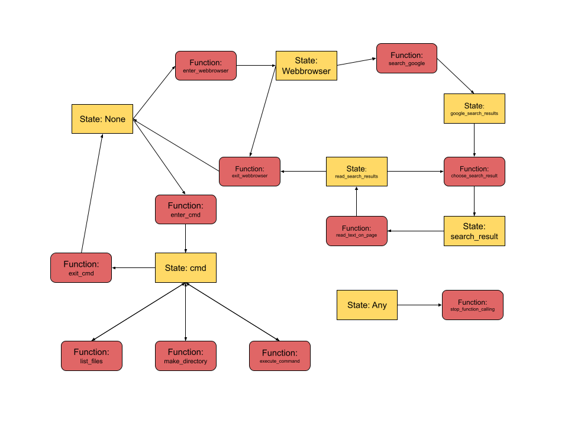

# FireAssistant

FireAssistant is a Python agent framework built around tool calling.

The idea is simple: instead of letting the model see every possible tool at once, FireAssistant limits the toolset based on the agent’s current state. That keeps the action space small, makes tool use more reliable, and gives the agent a cleaner flow for multi-step tasks like searching the web, reading pages, working with files, or running commands. 

Right now the project is centered around three main pieces:

- a lightweight tool/action system based on decorators
- an LLM wrapper for chat + tool calling
- a state-machine-driven agent loop that plans first, then executes tools until it decides it is done

## How it works

The agent starts in a planning state. From there, it is pushed to call a planning tool first, which uses a stronger model to generate a step-by-step plan for the task. After that, the main function-calling model carries out the task by selecting tools one at a time until it calls `stop_function_calling`.

The key design idea is the state machine.

Each action declares:

- the state(s) it can run in
- the state it changes to after execution

That means the model only sees the tools that actually make sense at that point in the workflow. For example, after a Google search, it can choose a result instead of immediately searching again. This is the main trick the project uses to make tool calling more structured and less messy.

## Current capabilities



### Web browsing
The web tool flow supports:

- entering the web browser
- searching Google
- choosing a search result
- reading page text and summarizing it against a query
- exiting the browser

### Command prompt / file operations
There is also a command-prompt toolset for basic local operations like:

- listing files
- changing directories
- making and removing directories
- creating, reading, writing, copying, moving, and deleting files
- running arbitrary commands from the terminal

### Python helper tools
The repo also includes helper tools that can:

- write a Python script from a description
- run a Python script
- debug a broken Python script
- ask for help if a task is failing

### Voice mode
There is a voice mode that uses speech-to-text for input and text-to-speech for responses, with wake-word listening built into the loop.

## Running the project

You will need:
- Python
- the openai package
- Selenium
- Firefox
- webdriver-manager
- whatever packages provide RealtimeSTT and RealtimeTTS in your environment

You will also need API access for the models you want to use. The current code references Fireworks models for the planner and main function-calling agent, and also uses an OpenAI client in places. llm.py currently has a placeholder Fireworks API key in code, so you will probably want to replace that with environment variables before doing anything real.

Text mode
```python fire.py```
Voice mode
```python fire.py --voice```

The text mode starts a simple CLI loop. Voice mode starts a wake-word listener and speaks responses out loud.

## Project structure

```text
FireAssistant/
├── fire.py
├── llm.py
├── planner.txt
└── actions/
    ├── action.py
    ├── default.py
    ├── web.py
    ├── cmd.py
    ├── llms.py
    └── __index__.py
